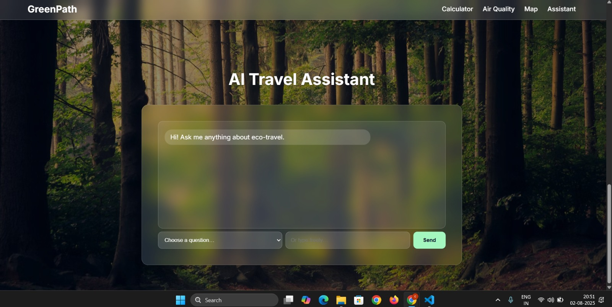
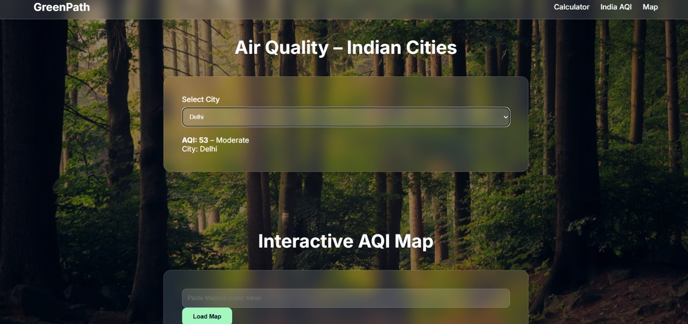
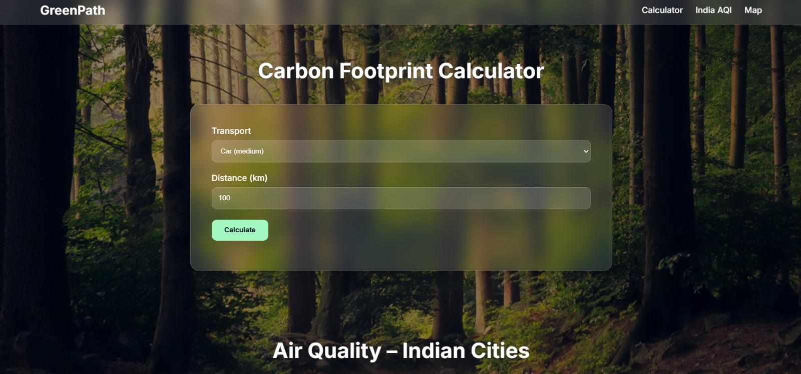
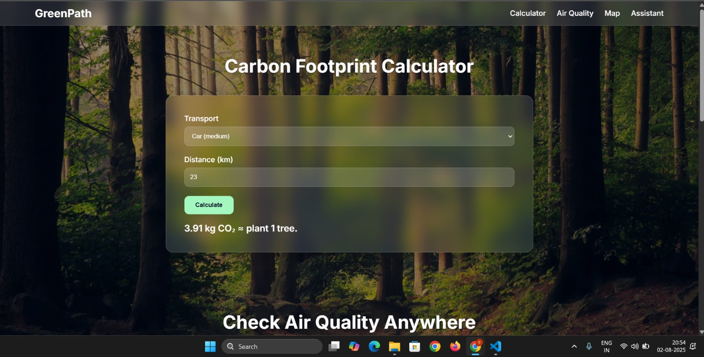

# 🌿 Eco Travel Mate – AI‑Powered Sustainable Travel Companion  
*Make travel greener, smarter, and healthier—every trip counts.*

🚀 Built in 48 hours during **Green Spark Hackathon 2025**  
🔗 [Live Preview](https://joemartinrince.github.io/Eco-/)

[](https://github.com/Christwin-Soy-Jose/eco-travel-mate)
[](https://flutter.dev)
[](LICENSE)

---

## 🎯 Problem Statement  
Short-distance car trips contribute significantly to:  
- 🌍 Urban carbon emissions  
- 🧍 Sedentary-lifestyle health issues  

Most people lack **real-time feedback** and motivating **nudges** to adopt greener travel habits.

---

## 🌱 What It Does  
**Eco Travel Mate** turns everyday travel into an eco‑friendly journey by:
- Detecting your travel mode (walk, bike, car, etc.)
- Calculating your CO₂ footprint
- Offering greener alternatives
- Rewarding you with GreenPoints and challenges

---

## 🧩 Core Features

### 🚶 Smart Travel Detection  
Detects walking, cycling, car rides, and public transport using GPS and activity recognition — no manual input.

### ♻️ Real-Time CO₂ Emissions Calculator  
Get your carbon impact instantly:  
> Car (2 km) → ~0.5 kg CO₂  
> Walk (2 km) → 0 kg CO₂, ~75 kcal burned

### 🌿 Greener Suggestion Engine  
Suggests eco travel alternatives:  
> "You could’ve saved 0.5 kg CO₂ and burned 75 kcal by walking."

### 🎮 GreenPoints & Weekly Challenges  
- Earn **GreenPoints** for every eco action  
- Take on weekly goals like replacing car trips with walks

### 👨‍👩‍👧‍👦 Family Groups & Leaderboards  
- Join groups  
- Compete via **GreenScores**  
- Build sustainable habits together 💚

---

## 🛠 Tech Stack  

| Module           | Technology Used                                |
|------------------|-------------------------------------------------|
| **Frontend**     | Flutter (Dart)                                  |
| **Backend**      | Firebase (Auth, Firestore, Cloud Functions), Flask |
| **Location**     | GPS, Geolocator plugin, Google Activity Recognition |
| **AI Logic**     | Travel-mode classifier, CO₂ footprint calculator |
| **Mapping**      | Google Maps SDK or Mapbox                       |
| **Gamification** | Custom point system, weekly challenges, leaderboards |

---

## 📱 Screenshots

| Feature           | Description                         | Preview                                     |
|------------------|-------------------------------------|---------------------------------------------|
| 🏠 Home Screen    | View your GreenScore and eco tips   |                  |
| 📊 Trip Log       | View trip history and CO₂ stats     |                     |
| 💡 Suggestions    | See greener travel alternatives     |                   |
| 🏆 Leaderboard    | Compete with your family/friends    |                  |

---

## 📸 Extended Features – Screenshots

| Feature                     | Description                                           | Preview                                     |
|-----------------------------|-------------------------------------------------------|---------------------------------------------|
| 🤖 AI Travel Assistant       | Intelligent Q&A for eco-travel queries               |                |
| 💨 Air Quality Monitor       | Real-time AQI for cities and interactive map         |                 |
| 📊 Carbon Calculator (Input) | Manual carbon footprint input interface              |                |
| 📈 Carbon Calculator (Result)| Display of calculated emissions and eco-equivalents |               |

---

## 🚀 Getting Started Locally

```bash
# 1. Clone the repository
git clone https://github.com/JoeMartinRince/Eco-.git
cd Eco-

# 2. Install dependencies
flutter pub get

# 3. Setup Firebase
# Add google-services.json (Android) or GoogleService-Info.plist (iOS) to the correct folders

# 4. Run the app
flutter run
